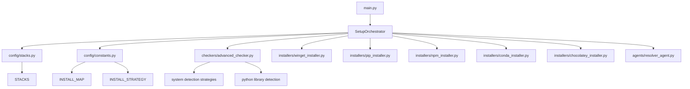
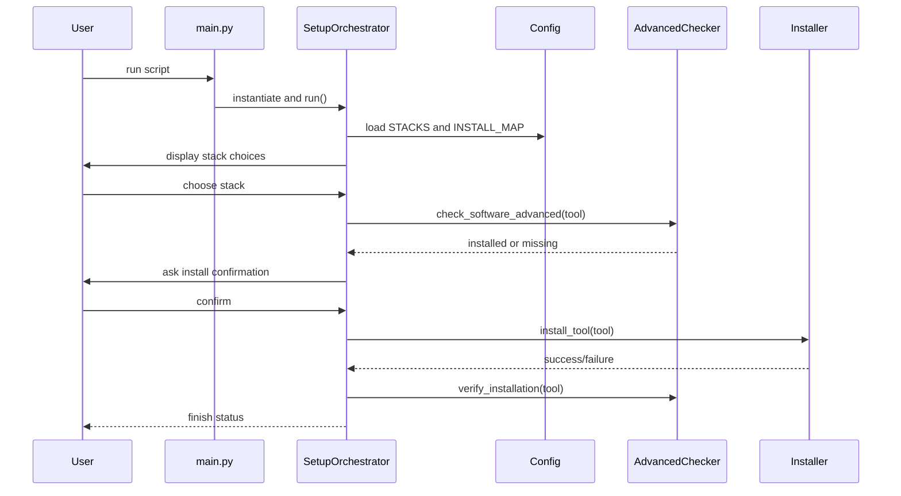

# Setup Automation Project Architecture

## Purpose

This repository builds a modular setup automation system for installing developer tools and stacks on Windows. It detects missing tools, chooses the right installer, and runs installation commands automatically.

## High-Level Overview

The architecture is organized by responsibility:

- `main.py` - Entry point
- `orchestrator/` - Core workflow and decision logic
- `config/` - Stack definitions and installation metadata
- `checkers/` - Software detection logic
- `installers/` - Installer implementations for each package manager
- `utils/` - Supporting helpers
- `agents/` - Experimental agent logic (currently not used in runtime)

## Component Diagram

## Runtime Workflow

1. `main.py` instantiates `SetupOrchestrator` and calls `run()`.
2. `SetupOrchestrator.display_stacks()` prints available stacks from `config/stacks.py`.
3. `SetupOrchestrator.get_user_choice()` reads user input and selects the requested stack.
4. `SetupOrchestrator.check_missing_tools()` loops over required tools and calls `check_software_advanced()`.
5. `check_software_advanced()` performs advanced detection using multiple strategies:
   - PATH check
   - version command check
   - known installation paths
   - Windows registry lookup
   - special handlers for Docker, VSCode, Android Studio, Unity, Blender, Ollama
6. Missing tools are collected.
7. `SetupOrchestrator.install_missing_tools()` prompts the user for confirmation.
8. For each missing tool, `SetupOrchestrator.install_tool()` chooses the installer based on `config/constants.py`:
   - `INSTALL_MAP` to select winget package IDs or `None`
   - `INSTALL_STRATEGY` to select `npm`, `pip`, `conda`, or `chocolatey`
9. The chosen installer class executes a subprocess command to install the package.
10. After installation, `verify_installation()` re-checks the tool using `check_software_advanced()`.

## Core Modules and Responsibilities

### 1. Entry Point

- `main.py`
  - Creates the orchestrator
  - Runs the workflow
  - Returns exit code 0 on success or 1 on failure

### 2. Orchestrator

- `orchestrator/setup_orchestrator.py`
  - Defines `SetupOrchestrator`
  - Holds available installer instances
  - Manages stack selection, tool detection, installation, and verification
  - Uses `INSTALL_MAP` and `INSTALL_STRATEGY` to resolve how each tool should be installed

### 3. Configuration

- `config/stacks.py`
  - Defines named development stacks and their required tools
  - Example stacks: `webdev`, `frontend`, `data_science`, `cloud_engineer`

- `config/constants.py`
  - Maps tool names to CLI commands via `COMMAND_MAP`
  - Defines version flags in `VERSION_FLAG`
  - Categorizes tool types in `TOOL_TYPE`
  - Defines `INSTALL_MAP` for winget package IDs and special handling
  - Defines `INSTALL_STRATEGY` for packages that require non-default installers

### 4. Software Detection

- `checkers/software_checker.py`
  - Basic detection for system commands and Python libraries
  - Uses subprocess version calls and Python import checks

- `checkers/advanced_checker.py`
  - More resilient detection with fallback strategies
  - Handles special cases for tools that are frequently installed outside PATH
  - Exposes `check_software_advanced(tool)` used by the runtime workflow

### 5. Installers

Each installer inherits from `installers/base_installer.py`.

- `installers/winget_installer.py` - installs via Windows `winget`
- `installers/pip_installer.py` - installs Python packages via pip
- `installers/npm_installer.py` - installs npm packages locally or globally
- `installers/conda_installer.py` - installs packages via `conda`
- `installers/chocolatey_installer.py` - installs via Chocolatey

### 6. Utilities and Agents

- `utils/helpers.py` - simple printing helpers for formatted output
- `agents/resolver_agent.py` - includes an analysis method, but it is currently imported and not used by the orchestrator

## Decision Logic

### Installer selection rules

- Default installer: `WingetInstaller`
- If `INSTALL_STRATEGY[tool] == "npm"` -> use `NpmInstaller`
- If `INSTALL_STRATEGY[tool] == "conda"` -> use `CondaInstaller`
- If `INSTALL_STRATEGY[tool] == "pip"` -> use `PipInstaller`
- If `INSTALL_STRATEGY[tool] == "chocolatey"` -> use `ChocolateyInstaller`
- If `INSTALL_MAP[tool]` is `None` and `TOOL_TYPE[tool]` is `python_lib` -> use `pip`
- If `INSTALL_MAP[tool]` is `None` and `TOOL_TYPE[tool]` is `npm_lib` -> use `npm`

### Example tool resolution

- `python` -> winget package `Python.Python.3.11`
- `pandas` -> pip install
- `react` -> npm install
- `docker` -> winget package `Docker.DockerDesktop`
- `unity` -> winget package `Unity.Hub`

## Important Notes for Any Other AI

- The current executable path is `main.py`; legacy files like `main_old.py` and `main1.py` are not part of the main workflow.
- `engine/installer.py` exists but is empty and unused.
- `agents/resolver_agent.py` is imported by the orchestrator but is not actually invoked.
- The project is built specifically for Windows, with detection logic that relies on Windows-specific paths and registry checks.
- The runtime loop is interactive: it expects user input to choose a stack and confirm installations.

## Suggested Improvements

- Remove or repurpose `engine/installer.py` if not needed.
- Use `ResolverAgent` or remove its import to avoid dead code.
- Add a proper `README.md` describing how to run the tool.
- Add automated tests for installer selection and detection flows.
- Add cross-platform support by making installer selection OS-aware.

## Sequence Diagram

## Recommended Summary for Another AI

- This is a Windows-focused setup automation tool.
- It selects predefined development stacks, detects missing software, and installs it automatically.
- Detection is handled by `checkers/advanced_checker.py`.
- Installation uses separate installer classes in `installers/`.
- Configuration is centralized in `config/constants.py` and `config/stacks.py`.
- The orchestrator is the main runtime controller.
- Some modules are currently unused and should be reviewed before extending.
